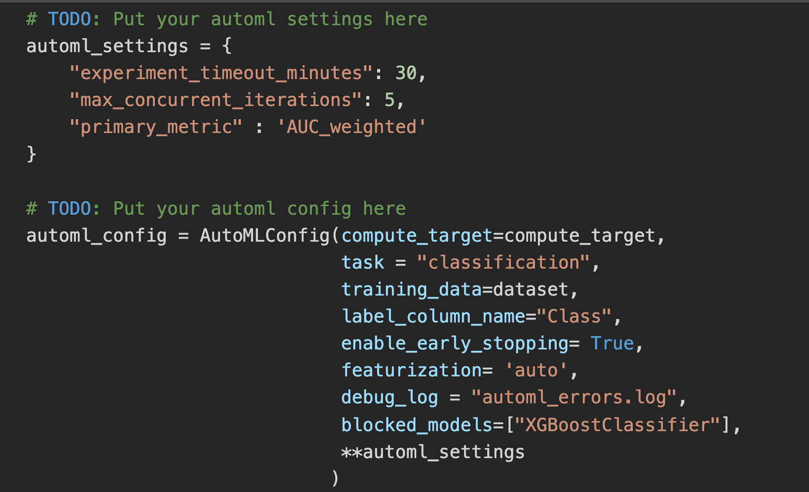
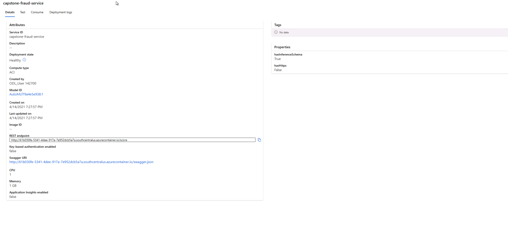

# Fraud Detection of Transactions With Azure ML

The financial industry is shifting currently towards machine learning solutions and is trying to become data driven.  
With that shift, previously manual tasks are being passed down to machine learning models.  
One of these tasks is being able to detect if a transaction is fraudulent or not so that customers are not charged for items that they did not purchase..  
The names of the columns though for security reasons have been removed.  
Usually in business cases like these we can expect demographic data, transaction speed, amount, location, etc  
Here though we are not able to reverse engineer that since the data have been under PCA transformation 

## Dataset

### Overview

As mentioned before the dataset is from a kaggle published problem to solve.  
I tried to load the dataset in my google drive and then access it from the notebook but I had issues with that so  
as can be seen in the screeshot below I have added the dataset manually in the azure ML studio.  

The dataset contains only numerical input variables which are the result of a PCA transformation.  
Feature 'Class' is the response variable and it takes value 1 in case of fraud and 0 otherwise.  

### Task

As said before the task is to identify fraudulent trasnactions. Since the datase thas already been preprocessed we will be using all the columns. 
Although in the extra suggestions we could definitely apply feature selection as a step.  

### Access

The dataset is quire large (140Mb csv file). I tried to upload it in my google drive and feed it from a link but there issues with the format.  
So I did load the dataset manualy in the Azure Studio dataset section.

## Automated ML

Below you can see our primary metrics for our model.  

We have choose weighted ACU for our metric since we have a very imbalanced dataset.  

### Results

In the photos below you can see the RunDetails. 

And also here are the information about the best model and its runID.  

The parameters of the best model can be seen below.  

## Hyperparameter Tuning

We start by setting up the train.py file where we load split in test and train data and we prepare our data b converting our categorical data to ints and then to dummy vars so we can apply our logistic regression model since log reg is not dealing directly with categorical data as a tree would do. We use stratify because we have an imbalanced datset when it comes to our target variable and we want to have a nice distribution of both classes in our train and test sets On the hyperparameter side we use max_itter as 20 or 100 which is the amount of iterations for the log reg. And C indicated the inverse of regularisation, It’s a penalty term, meant to disincentivize and regulate against Overfitting.

The random parameter sampler will choose randomly parameters from the potential parameter space and it is not exahustive like the complete grid parameter sampling. That is decreasing dramatically the time of the training while keeping the accuracy of the model high enough to solve common industry problems.

The BanditPolicy basically states to check the job every X amount iterations here in our case is 2. If the primary metric which we chose is outside of the top 10% range the jon will be terminated. This saves us from continuing to explore hyperparameters that don't show promise of helping reach our target metric.

### Results

The results we got with the hyperdrive are better but are not realistic. The model overfits and there is a very dominant class, the non fraudulent one.
It needs to be balanced.

## Model Deployment

In this screenshot we see the model id.

The endpoint alive and healthy.

And the result of testing two entries in the deployed model.

Before the deployment of the model we can save the environment dependencies.  

## Screen Recording

This is the link to the screencast. 
https://drive.google.com/file/d/1Mkth-x_EM2Bc3k7CvAfY5Qh8iXvkHt63/view?usp=sharing

## Standout Suggestions

Feature engineering.
Feature importance.
Feature selection.
Feature corelation analysis.

